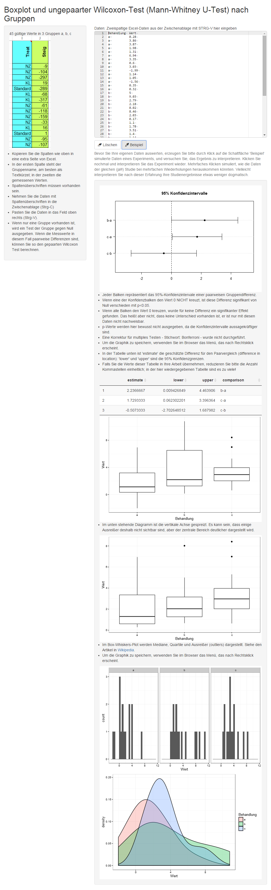

# Wilcoxon-Test and Confidence intervals from Excel data

German Shiny page to compute pairwise Wilcoxon tests from data marked with group labels.
Allows for copy/paste of data from Excel. Creates plots of confidence intervals of pairwise differences, and box-whiskers plot of the raw data, with and with outlier suppression. By design, no p-values are output, only confidence intervals of the differences. 

You can create sample data to simulate multiple repeats of a study and observe the horribly different conclusions that could be drawn on multiple runs. 

## Run it online

https://apps.menne-biomed.de/wctest/

## Screenshot



## Installation on Windows

- Get the installer from the [Docker store](https://store.docker.com/editions/community/docker-ce-desktop-windows). For earlier versions of Windows, use the [Docker toolbox](https://www.docker.com/products/docker-toolbox). For installation details, see [here](https://docs.docker.com/docker-for-windows/install/).  

- From the command line, enter the following to start the container

```
docker run --name wctests  -p 3838:3838 -d dmenne/wctests
```
- Connect to the app with your browser: [localhost:3838](`localhost:3838`). <- This link does not work when your read this from github or the Docker hub, only on your local installation.


