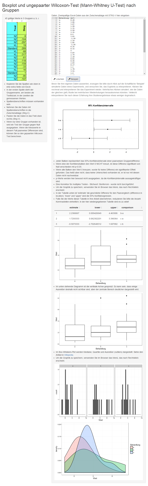

# Wilcoxon-Test and Confidence intervals from Excel data

German Shiny page to compute pairwise Wilcoxon tests from data marked with group labels.
Allows for copy/paste of data from Excel. Creates plots of confidence intervals of pairwise differences, and box-whiskers plot of the raw data, with and with outlier suppression. By design, no p-values are output, only confidence intervals of the differences. 

You can create sample data to simulate multiple repeats of a study and observe the horribly different conclusions that could be drawn on multiple runs. 

## Run it online

https://apps.menne-biomed.de/wctest/

## Screenshot

